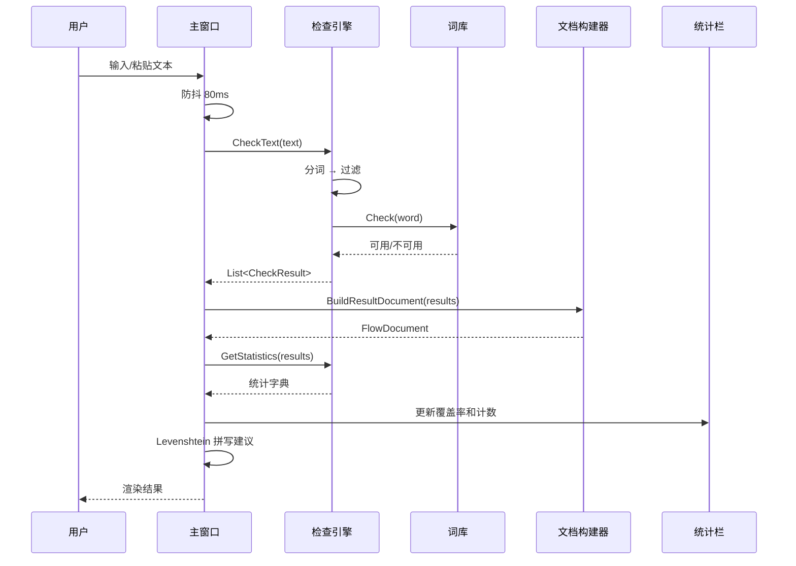
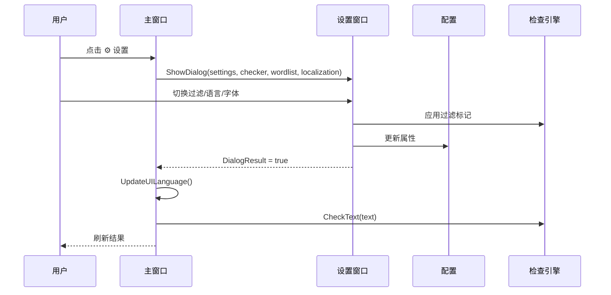

# 架构

## 模式概述

**总体模式：** 单部署 WPF 桌面应用——MVVM-lite + code-behind，面向服务的内部架构。

**关键特征：**
- 单体 WPF 桌面应用；所有组件在同一程序集中，通过直接方法调用通信
- 文本处理流水线：分词 → 过滤 → 查词 → 渲染，由实时输入驱动
- JSON 持久化配置和历史；词库使用 FrozenSet 实现 O(1) 查询

## 系统上下文

**角色：**
- 最终用户（SCP:SL 内容创作者/服务器管理员）——粘贴文本、查看检查结果、管理白名单

**外部系统：**
- GitHub API —— 自动更新检查（通过 `UpdateService`）
- 文件系统 —— 词库 TXT、配置 JSON、历史 JSON、多语言 JSON、导入文件
- Windows DWM —— 暗色标题栏 + Mica 背景（通过 `WindowHelper`）

## 分层

**Models** —— 核心业务逻辑和数据。`Models/`
- `Checker` —— 文本分词/过滤/查词；`WordList` —— FrozenSet 词库；`CheckResult` / `CheckStatus` —— 结果模型；`HistoryStore` —— 持久化历史；`Settings` —— 持久化用户配置

**Services** —— 横切工具类。`Resources/Services/`
- `LocalizationService` —— 多语言（惰性加载 JSON + 缓存）；`LevenshteinHelper` —— 编辑距离拼写建议；`DocumentBuilder` —— 结果 → `FlowDocument`；`MarkdownConverter` —— Markdown → FlowDocument；`UpdateService` —— GitHub 发布检查；`WindowHelper` —— Win32 DWM 集成

**Views** —— WPF 窗口。`Views/`
- `MainWindow` —— 主界面（输入/结果/统计/建议）；`SettingsWindow` —— 设置；`StatisticsWindow` —— 趋势图表；`HistoryWindow` —— 检查历史；`WhitelistWindow` —— 白名单管理；`AboutWindow` —— 关于页面

**Resources** —— 静态资源。`Resources/`
- `Styles.xaml` —— 全局暗色主题；`Locales/*.json` —— 多语言翻译（7 种语言）

**调用方向规则：**
- Views → Models（直接实例化/构造函数注入）
- Views → Services（直接方法调用）
- Models → 不依赖 Views 或 Services（纯逻辑）
- Services → 不依赖 Views

## 场景序列

### 文本检查流程

### 设置变更流程

## 关键对象状态机

不适用——单部署 WPF 应用，无跨模块聚合状态转换。状态管理限于内存中的 UI 状态和 JSON 持久化配置。

## 关键设计决策

- **[使用 WPF 而非其他 UI 框架]** —— 见 ADR-001
- **[使用 FrozenSet 做词库查询]** —— 见 ADR-002
- **[使用 JSON 而非 SQLite 做持久化]** —— 见 ADR-003
