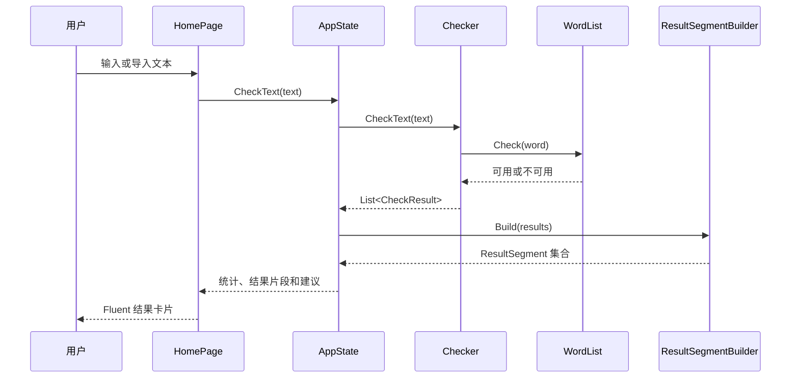
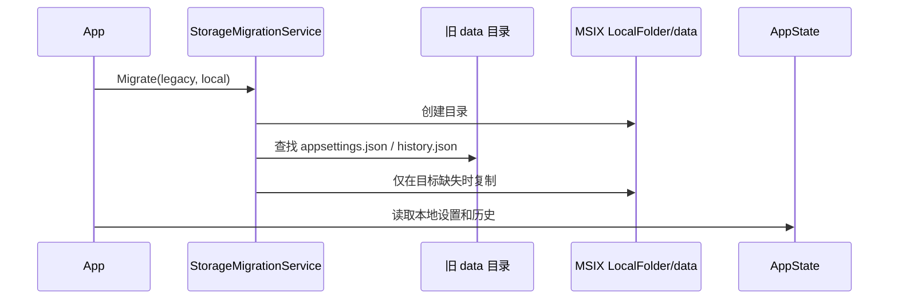

# 架构

## 模式概述

项目采用 Core 领域层加 WinUI 3 应用层的分层结构，并通过单项目 MSIX 发布。Core 只处理检查、词库、设置、历史、建议、统计和数据迁移，不引用任何窗口或控件类型；WinUI 层负责页面、状态协调和 Windows 平台适配。

文本处理流水线为：分词 → 格式与命名过滤 → 查词 → `ResultSegment` 构建 → Fluent 页面渲染。设置与历史使用 JSON，MSIX 安装目录保持只读，用户可写数据位于 `ApplicationData.Current.LocalFolder/data`。

## 分层

`CassieWordCheck.Core/` 承载 `Models/` 中的 `Checker`、`WordList`、`Settings`、`HistoryStore` 和结果模型，以及 `Resources/Services/` 中链接进 Core 的编辑距离、建议、字数统计、更新、本地化和数据迁移服务。

`CassieWordCheck.WinUI/` 是唯一桌面 UI 工程，使用 WinUI 3、Windows App SDK 1.8、NavigationView、Frame、ContentDialog、Mica 和 Fluent ResourceDictionary。`AppState` 统一持有 Core 服务，`Views/Pages/` 按功能分为主页、历史、统计、字数、词库、设置和关于页面。

`CassieWordCheck.WinUI/Package.appxmanifest`、`Assets/` 和 `Properties/PublishProfiles/win10-x64.pubxml` 构成单项目 MSIX 入口。签名属性默认关闭，CI 或正式发布环境通过证书属性启用签名。

## 调用方向

WinUI 页面 → `AppState` → Core 模型与服务；WinUI 平台服务集中处理文件选择、剪贴板、窗口句柄和对话框。Core 不反向引用 WinUI，也不直接访问 Dispatcher、Window 或 Control。

## 文本检查流程

```mermaid
sequenceDiagram
    participant User as 用户
    participant Home as HomePage
    participant State as AppState
    participant Checker as Checker
    participant List as WordList
    participant Builder as ResultSegmentBuilder

    User->>Home: 输入或导入文本
    Home->>State: CheckText(text)
    State->>Checker: CheckText(text)
    Checker->>List: Check(word)
    List-->>Checker: 可用或不可用
    Checker-->>State: List<CheckResult>
    State->>Builder: Build(results)
    Builder-->>State: ResultSegment 集合
    State-->>Home: 统计、结果片段和建议
    Home-->>User: Fluent 结果卡片
```

## 数据迁移流程

```mermaid
sequenceDiagram
    participant App as App
    participant Migration as StorageMigrationService
    participant Legacy as 旧 data 目录
    participant Local as MSIX LocalFolder/data
    participant State as AppState

    App->>Migration: Migrate(legacy, local)
    Migration->>Local: 创建目录
    Migration->>Legacy: 查找 appsettings.json / history.json
    Migration->>Local: 仅在目标缺失时复制
    App->>State: 读取本地设置和历史
```

## 关键设计决策

- WinUI 3 + Windows App SDK 1.8：统一桌面 UI、Fluent 交互和 Windows 10/11 支持。
- `FrozenSet`：词库加载后提供稳定的 O(1) 查询，并在批量导入后重新构建。
- JSON：保持原有用户数据格式，迁移成本低且便于手工检查。
- 单项目 MSIX：清单、资源和应用入口位于同一 WinUI 工程，减少 WAP 项目依赖并支持命令行生成 x64 包。
